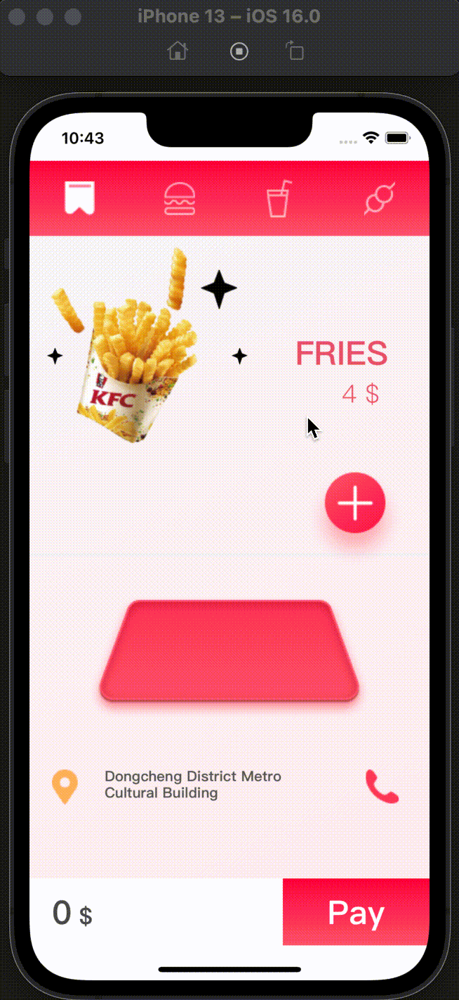

# 外卖 APP Demo

## 产品运行效果



## 项目初始化(MacOS)

```
# clone 项目
git clone https://github.com/Arfly/demo.git

# 进入项目目录
cd demo

# 安装依赖
yarn

# 链接原生组件
cd ios && pod install && cd ..

# 调试运行
yarn ios

```

## TODO

1. Tab 页面左右滑动时，食物组合图片的动画
2. Tab 页面左右滑动时，星星位置移动动画
3. Tab 页面左右滑动时，循环滚动问题
4. Tab 页面左右滑动时，无法滚动时，阻止添加按钮的淡出淡入动画
